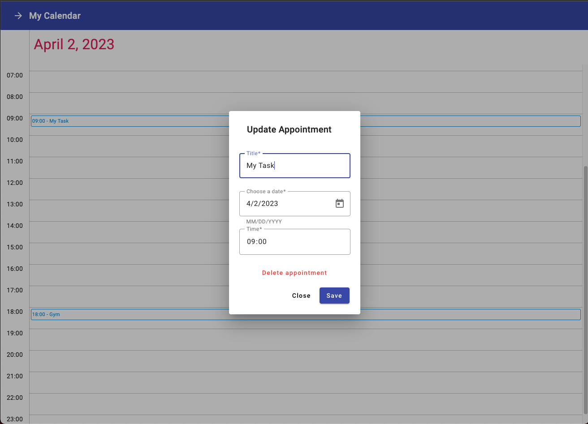
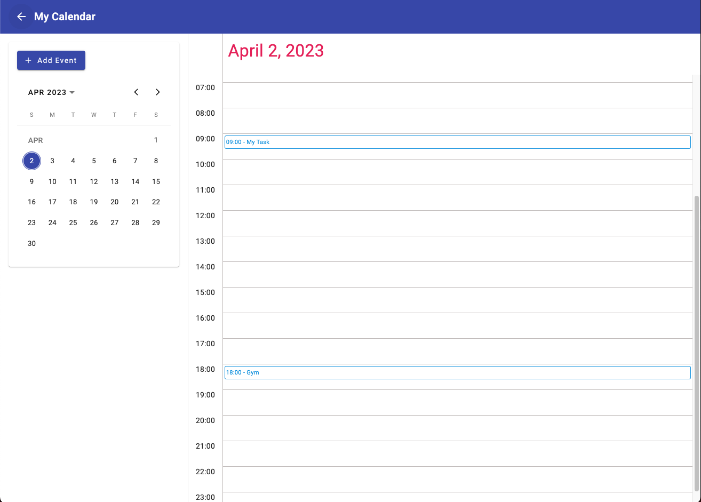
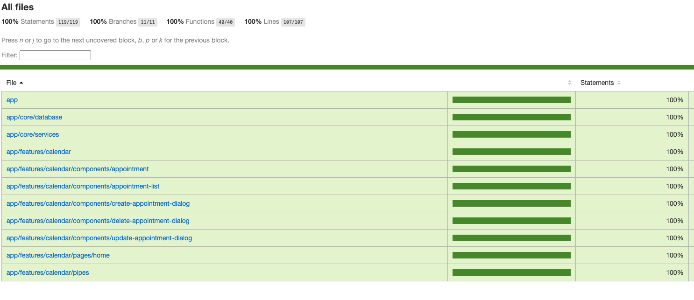

<!-- ABOUT THE PROJECT -->
## About The Project

Simple calendar inspired by Google Calendar

<table>
  <tr>
    <td valign="top"></td>
    <td valign="top"></td>
  </tr>
</table>


Requirements:

- [x] Form to add a calendar appointment
- [x] Ability to delete the appointment
- [x] Ability to move the appointment
- [x] Use Date() to work with time/date
- [x] Drag&Drop
- [x] Bonus: 
    - [x] Good and interactive design
    - [x] 100% tests coverage
    - [x] Cypress End to End tests
    - [x] Data persistencie
        - [x] Local Storage

Folder structure:

Core: Business logic of the application, containing singleton services. <br>
Features: Single part of UI that do one job. It can contain multiple pages and components. <br>

- app
  - core
    - database
    - models
    - services
  - features
    - calendar
      - components
      - pages
      - pipes

<!-- GETTING STARTED -->
## Getting Started

### Installation

1. Install NPM packages
   ```sh
   npm install
   ```
2. Run the Project
   ```
   npm run start
   ```
3. Open browser in <a href="http://localhost:4200/">http://localhost:4200/</a>

### Tests
<br>
Jasmine for unit and integration tests.
<br> <br>
  

1. Unit Tests
   ```sh
   npm run test
   ```
2. e2e Tests
   ```sh
   npm run e2e
